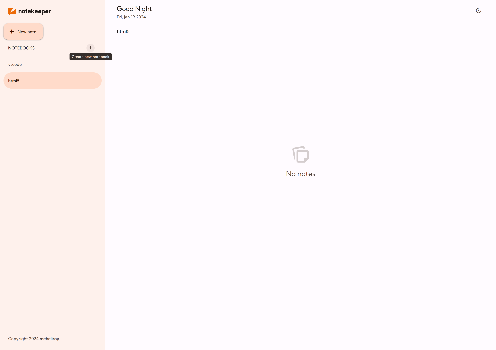
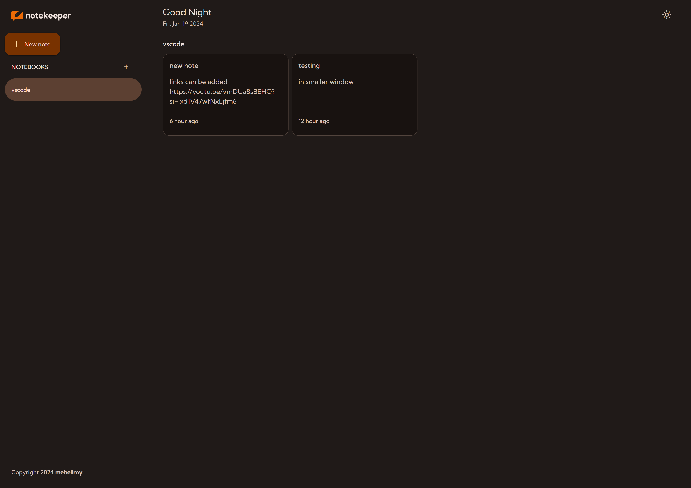
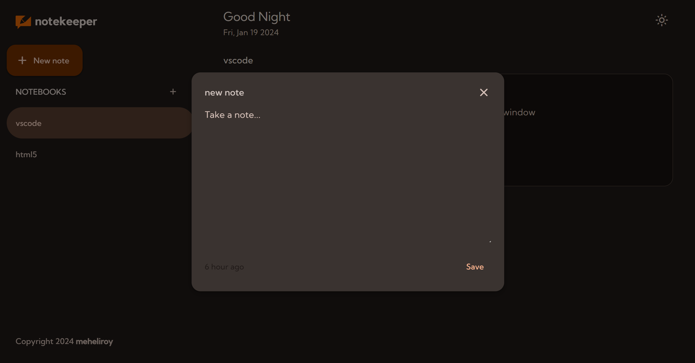

# NOTABLES 

Have a look ! 
[Notables](https://mehelir.github.io/Notables/)

## Introduction

### A Note-Keeper

Create, Read, Update, Delete (CRUD) in Vanilla JavaScript : Note Taking Application

## Table of Contents

1. [Project Overview](#project-overview)
2. [Getting Started](#getting-started)
   - [Prerequisites](#prerequisites)
   - [Installation](#installation)
3. [Project Structure](#project-structure)
4. [HTML](#html)
   - [index.html](#indexhtml)
5. [CSS](#css)
   - [style.css](#stylecss)
6. [JavaScript](#javascript)
   - [app.js](#appjs)
   - [client.js](#clientjs)
   - [db.js](#dbjs)
   - [theme.js](#themejs)
   - [utils.js](#utilsjs)
   - [Card.js](#cardjs)
   - [Modal.js](#modaljs)
   - [NavItem.js](#navitemjs)
   - [Tooltip.js](#tooltipjs)
7. [Functionality](#functionality)
8. [Screenshots](#screenshots)
9. [Contributing](#contributing)
10. [License](#license)

## Project Overview

The note-taking web app, "Notekeeper," boasts a seamless user experience with a sophisticated set of features, meticulously organized across its codebase:

#### 1. Responsive Design & Intuitive UI :

- A visually appealing and responsive user interface crafted in index.html ensures a seamless experience across devices.
#### 2. Elegant Styling:

- The stylish presentation is achieved through the carefully designed `style.css` file, creating an aesthetic appeal that enhances user engagement.
#### 3. Dynamic Note-Taking:

- The heart of the application lies in `app.js`, where a responsive design comes to life, featuring a toggleable sidebar, tooltip initialization, and a homepage that greets users with a personalized message and the current date.
#### 4. Effortless CRUD Operations:

`client.js` takes center stage, managing Create, Read, Update, and Delete (CRUD) operations effortlessly on both notebooks and notes. The UI dynamically updates to reflect changes, offering a seamless and efficient note management experience.
#### 5. Local Database Management:

- `db.js` orchestrates the initiation and management of the local database, notekeeperDB. It skillfully handles data persistence, loading existing data from local storage, and seamlessly integrating CRUD operations to ensure a robust data management system.
#### 6. Theme Customization:

- `theme.js` initiates and manages the theme, allowing users to toggle between a light and dark mode, enhancing the visual appeal and customization options of the application.
#### 7. Utility Functions for Enhanced Functionality:

- `utils.js` introduces a plethora of utility functions, ranging from event handling and dynamic content generation to DOM manipulation, unique ID generation, and efficient database queries. These functions collectively elevate the application's functionality and user experience.
####  8. Element-Specific Modules:

- Specialized modules such as `Card.js` create HTML card elements representing notes, complete with detailed views and edit functionality. `Modal.js` seamlessly manages modals for adding or editing notes, while NavItem.js handles the creation of navigation items representing notebooks. Additionally, `Tooltip.js` enhances user interactions by attaching tooltip behavior to specified DOM elements.

In summary, "Notekeeper" is a masterfully crafted note-taking web app, seamlessly combining elegant design with powerful functionality, creating an unparalleled user experience in the world of digital note management.

## Getting Started

### Prerequisites

- Modern web browser (Chrome, Firefox, Safari, etc.).

### Installation
1. Clone the repository or download the project files to your local machine.
2. Open `index.html` in your web browser.

## Project Structure
The project is organized into multiple files for better code organization and separation of concerns:

- `index.html` : The main HTML file that contains the user interface.
- `style.css` : The CSS file that defines the styling for the web application.
- `app.js` : The note-taking web app has a responsive design with a toggleable sidebar, tooltip initialization, homepage greeting, date display, dynamic notebook and note creation, database integration, and a comprehensive note management system.
- `client.js` : Facilitates CRUD operations on notebooks and notes, dynamically updating UI elements and managing "Create Note" button states based on notebook existence.
- `db.js` : Outlines the initiation and management of a local database (notekeeperDB) through CRUD operations, utilizing global variables and local storage for data persistence.
- `theme.js` : Involves initializing the theme and attaching the toggleTheme function to the click event of a theme button.
- `utils.js` : Outlines event handling, dynamic content generation, DOM manipulation, unique ID generation, database queries, array indexing, and timestamp conversion for a note-taking application.
- `Card.js` : Element representing a note, including a detailed view and edit functionality.
- `Modal.js` : Creates and manages a modal for adding or editing notes.
- `NavItem.js` : Creates a navigation item representing a notebook.
- `Tooltip.js` : Attaches a tooltip behavior to a given DOM element.

## HTML

Defines the basic layout of the app,it includes meta information, a title, and description. The page features a dark theme with a custom SVG favicon and implements theme-switching functionality through a JavaScript file. The header section contains a sidebar, logo, menu button, and options for managing notebooks. Navigation elements, copyright information, and main content with a greeting, current date, and theme toggle button are present. A floating action button allows the creation of new notes, and modals for creating and deleting notes are commented out. 

### index.html

The main HTML file contains the structure of the Notekeeper Website.

## CSS

### style.css

The CSS code defines a dark and light theme for a note-taking web app, including color schemes, typography, spacing, and components like buttons and modals. It incorporates responsive design with media queries for various screen sizes, emphasizing a clean and visually appealing user interface with attention to detail and interaction elements.

## JavaScript

### app.js

Outlines features and functionality for a note-taking web app. It includes a toggleable sidebar for small screens, initializes tooltips for elements with 'data-tooltip,' displays a greeting and current date on the homepage. Additionally, it details the creation of notebooks and notes, dynamically rendering and storing data in a database, showcasing a comprehensive note management system.

### client.js

Includes enabling or disabling "Create Note" buttons based on notebook existence. The client object manages UI interactions, offering functions for CRUD operations on notebooks and notes, updating the UI accordingly. It details processes for creating, reading, updating, and deleting notebooks and notes in the user interface.

### db.js

The initialization of a local database, loading existing data from local storage or creating a new empty structure. It describes operations on a global variable notekeeperDB, including reading and writing to local storage. The provided collection of functions facilitates CRUD operations on the database, managing data through global variables and local storage. These functions cover retrieving all notebooks and notes, updating notebook and note information, and deleting notebooks and notes from the database.

### theme.js

A functionality that toggles the theme between 'light' and 'dark,' managing both the theme setting in the DOM and local storage. It involves initializing the theme and attaching the toggleTheme function to the click event of a theme button.

### utils.js

Attaches an event listener to a collection of DOM elements.Generates a greeting message based on the current hour of the day.Makes a DOM element editable by setting the 'contenteditable' attribute to true and focusing on it.Generates an unique ID on the current timestamp.Finds a notebook in database by its ID.Finds the index of a notebook in an array of notebooks based on its ID.Converts a timestamp in millisecond to s human-readable relative time string.Finds a specific note by its ID within a database of notebooks and their notes.Finds the index of a note in a notebook's array of notes based on its ID.

### components

### Card.js

The creation of an HTML card element representing a note, including a detailed view and edit functionality. It attaches a click event listener to the card for opening a modal to update the note. Additionally, it implements note delete functionality with a confirmation modal and updates the UI and database accordingly upon confirmation.

### Modal.js

Creates and manages a modal for adding or editing notes. The modal allows users to input a note's title and text, and provides functionality to submit and save the note.Handles the submission of a note within the modal.Creates and manages a modal for confirming the deletion of an item.Handles the submission of the delete confirmation.

### NavItem.js

Creates a navigation item representing a notebook.This item displays the notebooks's name, allows editing and deletion of the notebook, and handles click events to display its associated notes.

### Tooltip.js

Attaches a tooltip behavior to a given DOM element.When the element is hovered over, a tooltip with the specified content is displayed.The tooltip is automatically positioned below the element.

## Functionality

- Responsive Design & Intuitive UI
- Elegant Styling
- Dynamic Note-Taking
- Effortless CRUD Operations
- Local Database Management
- Theme Customization
- Utility Functions for Enhanced Functionality
- Element-Specific Modules

## Screenshots

### Home Page

#### Light-Theme

#### Dark-theme

### More Details Page

Samsung Galaxy S20 Ultra

iPad Air

1600x1200

## Contributing

We welcome contributions to enhance the project! If you find any issues or have ideas for improvements, please don't hesitate to report them through GitHub issues. You can also suggest enhancements or submit pull requests to help make this project even better.

## License

This project is distributed under the MIT License. You can find the full text of the license in the [LICENSE]( https://github.com/MeheliR/Notables/blob/main/LICENSE) file.
